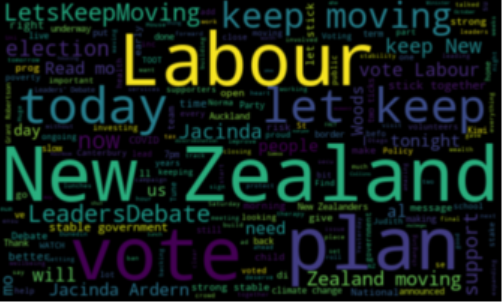
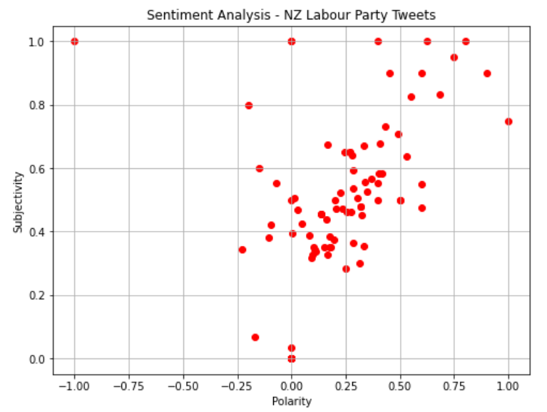
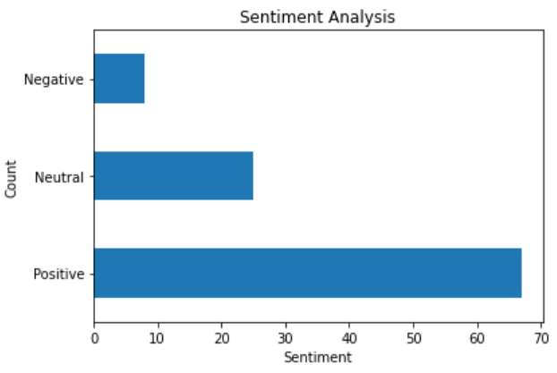

# New Zealand Labour Party Sentiment Analysis

Sentiment analysis consists of extracting emotions related to raw text to understand if users are positive or negative and why (Towards Data Science, 2018).

For this project, I went through the last 100 tweets from the NZ Labour Party and categorized them into positive, neutral, and negative. It was found that among the 100 tweets, 92% of them were positive or neutral in which corroborated that the Labour Party is on one of its best political moments.

## Table of Contents
- [Word Cloud](https://github.com/LaraBruno/NZ-Labour-Party-Sentiment-Analysis#word-cloud---most-used-words-on-twitter)
- [Polarity/Subjectivity Plot](https://github.com/LaraBruno/NZ-Labour-Party-Sentiment-Analysis#polaritysubjectivity-plot)
- [Count of negative, neutral, and positive tweets](https://github.com/LaraBruno/NZ-Labour-Party-Sentiment-Analysis#count-of-negative-neutral-and-positive-tweets)
- [Jupyter Notebook Viewer](https://github.com/LaraBruno/NZ-Labour-Party-Sentiment-Analysis#jupyter-notebook-viewer)

## Data Visualization

## Word cloud - Most used words on Twitter

## Polarity/Subjectivity Plot

## Count of negative, neutral, and positive tweets

## Jupyter Notebook Viewer
https://nbviewer.jupyter.org/github/LaraBruno/NZ-Labour-Party-Sentiment-Analysis/blob/main/Sentiment%20Analysis%20Study.ipynb
